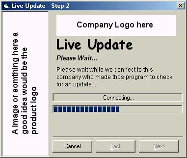



## Professional Live Update

### Description

This code is fully commented !!! This will update your program by downloading a new one and then kill the old one!!! It's kewl! :D try it OUT! Thnx to dreamvb for the help thx dude ;) and for all u vb programmers log onto irc.vbchat.com get mirc from mirc.com and log onto the chat room #vbchat

The ppl who submit to pscode you are the ppl who make pscode what it is today

Thanks and Enjoy

Sammy

Please vote for this code if u like it!!!

Any problems mail me @ sammyrhys@hotmail.com
 
### More Info
 

             |
---                |---
**Submitted On**   |2001-10-23 23:01:14
**By**             |[VBRules](https://github.com/Planet-Source-Code/PSCIndex/blob/master/ByAuthor/vbrules.md)
**Level**          |Intermediate
**User Rating**    |3.9 (35 globes from 9 users)
**Compatibility**  |VB 5\.0, VB 6\.0
**Category**       |[Internet/ HTML](https://github.com/Planet-Source-Code/PSCIndex/blob/master/ByCategory/internet-html__1-34.md)
**World**          |[Visual Basic](https://github.com/Planet-Source-Code/PSCIndex/blob/master/ByWorld/visual-basic.md)
**Archive File**   |[Profession3074310232001\.zip](https://github.com/Planet-Source-Code/vbrules-professional-live-update__1-28366/archive/master.zip)

